# Hi, I'm Craig 👋

### Cybersecurity · Software Engineering · AI Systems · Automation

Computer Science student at **City, University of London** building practical software across cybersecurity, AI infrastructure, full-stack applications, automation, and data.

I'm particularly interested in roles involving:

**Cybersecurity Engineering · Software Engineering · AI/Automation · Infrastructure**

Currently involved with the **National Cyber Resilience Centre Group** through the **Cyber PATH** programme.

📂 **[See what I'm building →](https://navysum-site.ataidecraig.workers.dev)** — project pages with live demos on sample data, a map of my homelab, and write-ups on how each one was built.

---

## 👨‍💻 About Me

- 🛡 Interested in defensive security, secure systems and infrastructure
- 🤖 Building self-hosted AI agents and automation workflows
- 📱 Developing cross-platform applications with React Native and TypeScript
- 🐧 Running and managing Linux infrastructure and Docker services
- 📊 Building Python tooling for data analysis and quantitative research
- 🔐 Interested in authentication, authorisation and secure application design

---

# ⭐ Featured Project

## [StreakMates](https://github.com/navysum/StreakMates)

**A social habit tracker built around accountability with friends.**

**React Native · Expo · TypeScript · Supabase · PostgreSQL**

StreakMates supports private and shared habits, groups, realtime activity, leaderboards, offline check-ins and cross-platform deployment across **iOS, Android and Web**.

### Engineering highlights

- 🔐 PostgreSQL **Row Level Security** for database-level authorisation
- 🧪 Security attack suite testing access from multiple user roles
- 📴 Offline-first architecture with queued and replayed check-ins
- ⚡ Supabase Realtime updates
- 🔑 Google OAuth with PKCE
- 📊 Fairness-aware leaderboard algorithms
- 🎨 Tested light/dark design system and accessibility rules
- 📱 Single React Native / Expo codebase for mobile and web
- ✅ Automated unit, security and browser testing

[View the code →](https://github.com/navysum/StreakMates)

---

# 🚀 Current Projects

| Project | Description | Technologies |
|---|---|---|
| [**StreakMates**](https://github.com/navysum/StreakMates) | Social habit tracking and accountability platform | React Native · Expo · TypeScript · Supabase · PostgreSQL |
| **LifeOS** 🔒 | Personal dashboard connecting tasks, habits, finance, health and system data | React · TypeScript · Python · APIs |
| [**Hermes Agent Infrastructure**](https://github.com/navysum/hermes-agent-infrastructure) | Infrastructure for persistent AI agents, automation and research workflows | Python · Linux · Docker · APIs |
| **Trading Research** 🔒 | Backtesting, strategy analysis and quantitative research tooling | Python · Pandas · NumPy |

> 🔒 Some projects remain private while they are actively being developed.

---

# 🧠 Technical Skills

### Software Engineering

- Cross-platform application development
- REST API integration
- Authentication and authorisation
- Offline-first application design
- Database design
- Testing and debugging
- Git-based development workflows

### Cybersecurity

- Defensive security
- Network analysis
- Linux security
- Log analysis
- Access-control design
- PostgreSQL Row Level Security
- Security testing
- CTF and lab environments

### AI & Automation

- AI agent infrastructure
- Multi-agent workflows
- LLM integrations
- API-driven automation
- Scheduled workflows
- Self-hosted AI systems
- Monitoring and research automation

### Infrastructure

- Linux VPS administration
- Docker
- Self-hosted services
- API integrations
- Deployment and monitoring
- Hetzner cloud infrastructure

---

# 🛠 Tech Stack

### Languages

### Application Development

### Infrastructure & Security

### Data & Databases

### Tools

---

# 📊 GitHub Activity

---

# 🤝 Connect

